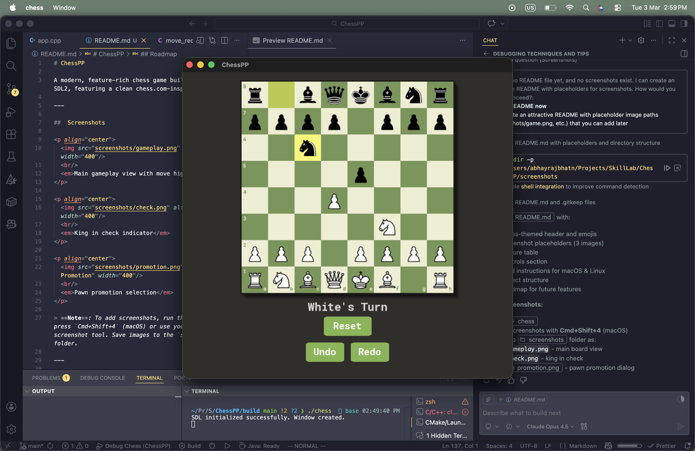
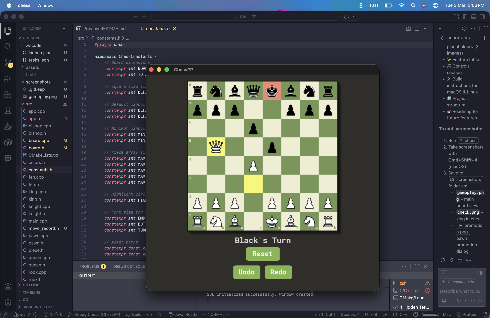
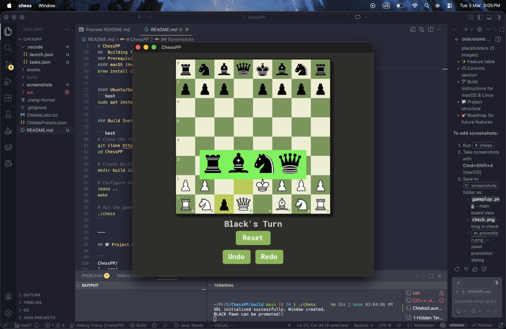

# ChessPP

A modern, feature-rich chess game built with C++ and SDL2, featuring a clean chess.com-inspired interface.

---

##  Screenshots

<p align="center">
  
  <br/>
  <em>Main gameplay view with move highlighting</em>
</p>

<p align="center">
  
  <br/>
  <em>King in check indicator</em>
</p>

<p align="center">
  
  <br/>
  <em>Pawn promotion selection</em>
</p>


---

## Features

| Feature | Description |
|---------|-------------|
|  **Undo/Redo** | Full move history with unlimited undo/redo |
|  **Castling** | Both kingside and queenside castling supported |
|  **Promotion** | Visual piece selection for pawn promotion |
|  **Check Detection** | Highlighted king when in check |
|  **Checkmate/Stalemate** | Automatic game end detection |
|  **Move Highlighting** | Last move and valid moves displayed |

---


##  Building from Source

### Prerequisites

- **CMake** (3.10+)
- **SDL2**
- **SDL2_ttf**
- **SDL2_gfx**

#### macOS (Homebrew)
```bash
brew install cmake sdl2 sdl2_ttf sdl2_gfx
```

#### Ubuntu/Debian
```bash
sudo apt install cmake libsdl2-dev libsdl2-ttf-dev libsdl2-gfx-dev
```

### Build Instructions

```bash
# Clone the repository
git clone https://github.com/yourusername/ChessPP.git
cd ChessPP

# Create build directory
mkdir build && cd build

# Configure and build
cmake ..
make

# Run the game
./chess
```

---

## 📁 Project Structure

```
ChessPP/
├── src/
│   ├── main.cpp          # Entry point
│   ├── app.cpp/h         # Application & SDL setup
│   ├── board.cpp/h       # Game board & logic
│   ├── square.cpp/h      # Individual squares
│   ├── piece.h           # Base piece class
│   ├── pawn.cpp/h        # Pawn implementation
│   ├── rook.cpp/h        # Rook implementation
│   ├── knight.cpp/h      # Knight implementation
│   ├── bishop.cpp/h      # Bishop implementation
│   ├── queen.cpp/h       # Queen implementation
│   ├── king.cpp/h        # King implementation
│   ├── fen.cpp/h         # FEN notation parser
│   ├── move_record.h     # Move history structure
│   ├── state.h           # Game state enums
│   ├── colors.h          # Color definitions
│   └── constants.h       # Game constants
├── assets/               # Piece images & fonts
├── screenshots/          # Game screenshots
├── CMakeLists.txt
└── README.md
```

---

##  Roadmap

- En passant capture
- Move notation display
- Game save/load
- AI opponent
- Online multiplayer
- Sound effects
- Custom themes

---

##  License

This project is open source and available under the [MIT License](LICENSE).

---


